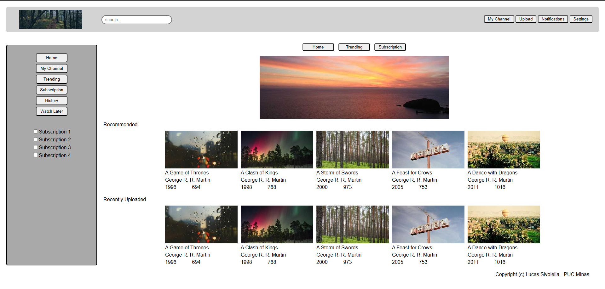
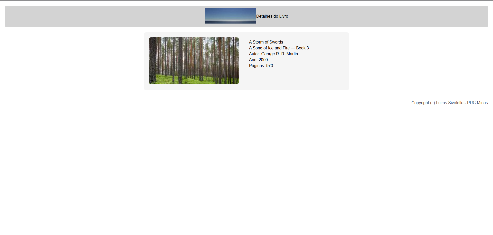

# Trabalho Prático 05 - Semanas 7 e 8

**Páginas de detalhes dinâmicas**

Nessa etapa, vamos evoluir o trabalho anterior, acrescentando a página de detalhes, conforme o  projeto escolhido. Imagine que a página principal (home-page) mostre um visão dos vários itens que existem no seu site. Ao clicar em um item, você é direcionado pra a página de detalhes. A página de detalhe vai mostrar todas as informações sobre o item do seu projeto. seja esse item uma notícia, filme, receita, lugar turístico ou evento.

Leia o enunciado completo no Canvas. 

**IMPORTANTE:** Assim como informado anteriormente, capriche na etapa pois você vai precisar dessa parte para as próximas semanas. 

**IMPORTANTE:** Você deve trabalhar e alterar apenas arquivos dentro da pasta **`public`,** mantendo os arquivos **`index.html`**, **`styles.css`** e **`app.js`** com estes nomes, conforme enunciado. Deixe todos os demais arquivos e pastas desse repositório inalterados. **PRESTE MUITA ATENÇÃO NISSO.**

## Informações Gerais

- Nome: Lucas Sivolella
- Matricula: 902408
- Proposta de projeto escolhida: Pessoas e Produções
- Breve descrição sobre seu projeto: Layout de um site feito as linguaguens HTML e CSS (no momento sem a implementação do Bootstrap). Site capaz de realizar o carregamento dinâmico de informações.

## Print da Home-Page



## Print da página de detalhes do item



## Estrutura JSON utilizada no app.js

```javascript
const livros = [
  {
    id: 1,
    titulo: "A Game of Thrones",
    subtitulo: "A Song of Ice and Fire — Book 1",
    autor: "George R. R. Martin",
    ano: 1996,
    imagem: "https://picsum.photos/seed/agot/230/120",
    paginas: 694
  }
]
```